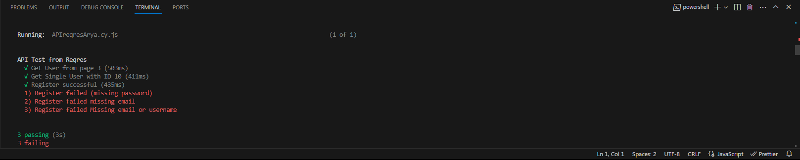

# API Testing with Cypress

This project objective is to perform API automation testing on https://reqres.in with Cypress using API Plugin. There are a certain steps to perform the test from this project.


## Running Tests
Clone the project

```bash
  git clone https://github.com/christhoperca/esb-api-arya
```

To run tests, run the following command

```bash
  npm run cypress:open
```
Or

```bash
  npx cypress run --spec cypress\e2e\apireqres\APIreqresArya.cy.js
```


## Results




